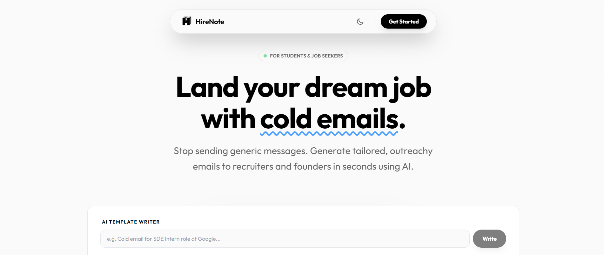
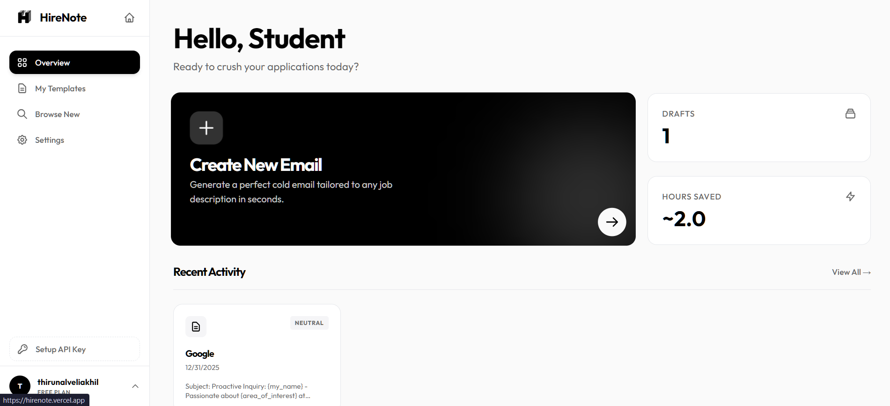
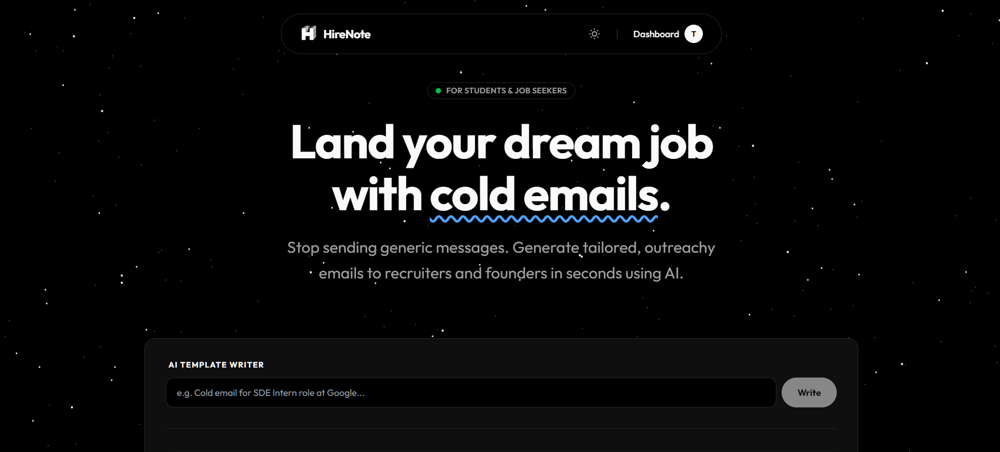
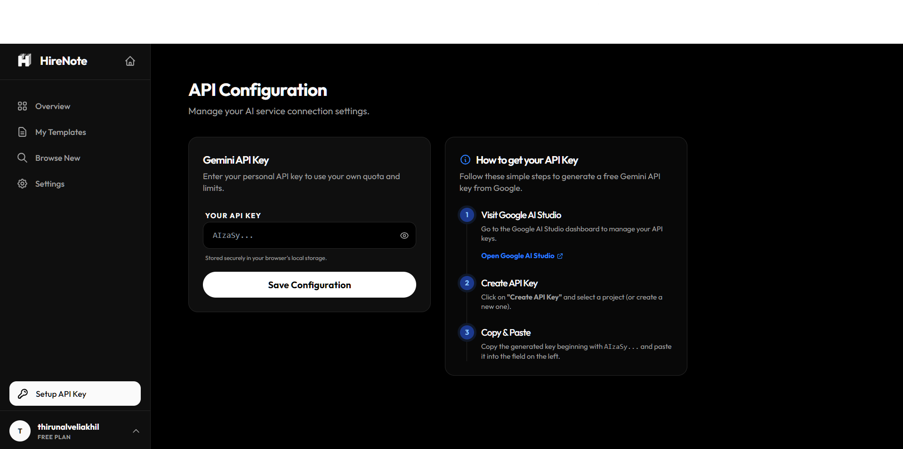
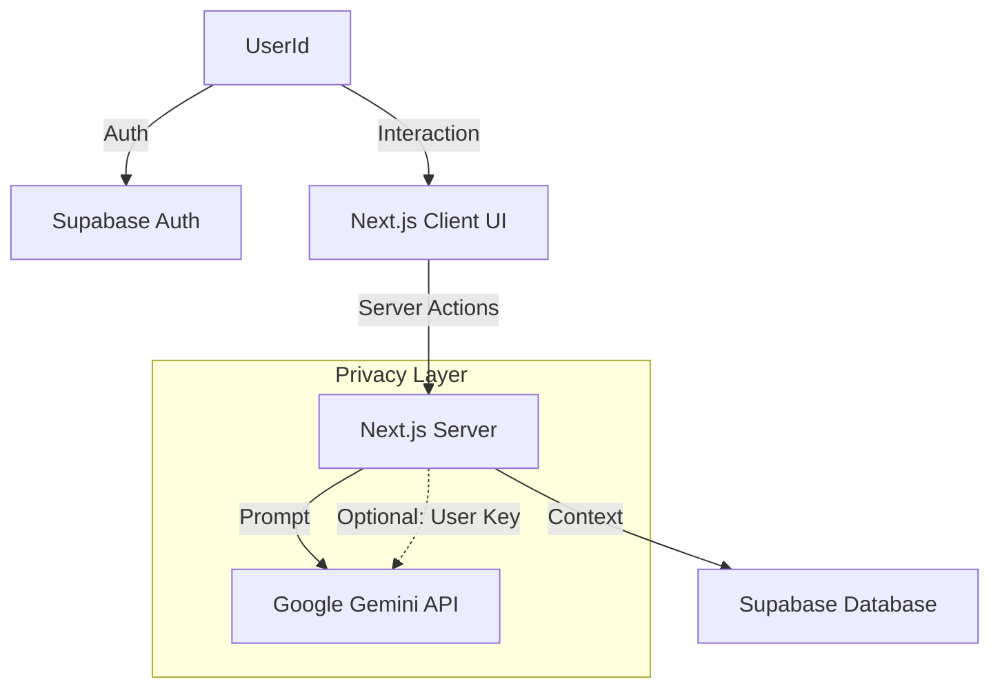
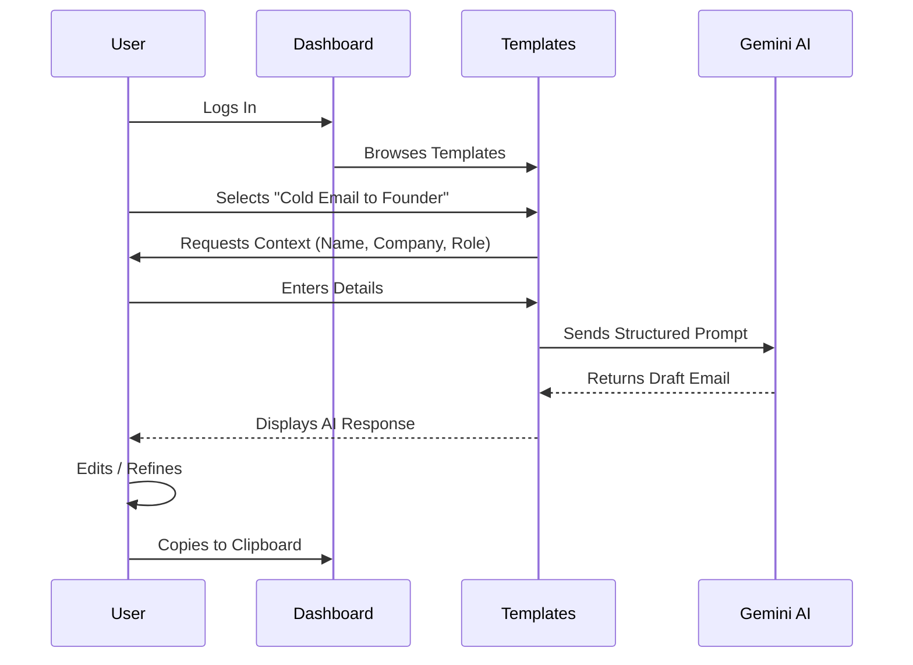

<p align="left">
  
</p>

# HireNote


**Land your dream job with cold emails generated in seconds.**

HireNote is an AI-powered outreach assistant designed for students and job seekers. It transforms generic networking requests into tailored, professional cold emails that get responses. Built with modern web technologies and a focus on privacy and user experience.




## Key Features

- **AI-Powered Writing**: Generate contextual cold emails, follow-ups, and networking requests using Google Gemini Pro.
- **Template System**: Browse, create, and manage reusable templates for different scenarios (e.g., "Sales Pitch", "Mentorship Request").
- **Bring Your Own Key (BYOK)**: Privacy-first architecture allows users to use their own Gemini API Key for unlimited generation.
- **Beautiful UI**: Fully responsive interface with smooth Dark/Light mode transitions and glassmorphism design.
- **Secure Authentication**: Robust user management via Supabase Auth.
- **Real-time & Fast**: Built on Next.js 15 App Router for blazing fast performance and SEO.

## Screenshots

| Dashboard (Light) | Dashboard (Dark) |
|:---:|:---:|
|  |  |

| Generate (Light) | API (Dark) |
|:---:|:---:|
|  |  |

## Architecture

### System Overview


### User Journey


## 🚀 Getting Started

Follow these steps to run HireNote locally.

### Prerequisites
- Node.js 18+
- npm / yarn / pnpm
- A Supabase project (for Auth & DB)
- Google Gemini API Key

### Installation

1.  **Clone the repository**
    ```bash
    git clone https://github.com/akhilthirunalveli/HireNote.git
    cd HireNote
    ```

2.  **Install dependencies**
    ```bash
    npm install
    ```

3.  **Configure Environment**
    Create a `.env.local` file in the root directory:
    ```bash
    NEXT_PUBLIC_SUPABASE_URL=your_supabase_url
    NEXT_PUBLIC_SUPABASE_ANON_KEY=your_supabase_anon_key
    GEMINI_API_KEY=your_default_server_key (optional fallback)
    ```

4.  **Run the functionality**
    ```bash
    npm run dev
    ```

    Open [http://localhost:3000](http://localhost:3000) to view the app.


## 📁 Project Structure

```bash
├── app/                  # Next.js App Router
│   ├── api/              # API Routes (Edge/Serverless)
│   ├── auth/             # Authentication Logic
│   ├── dashboard/        # Protected User Area
│   └── page.tsx          # Landing Page
├── components/           # React Components
│   ├── dashboard/        # Dashboard-specific UI
│   ├── home/             # Landing Page UI
│   ├── template/         # Template Engine UI
│   └── ui/               # Shared Reusable Components
├── hooks/                # Custom React Hooks (useTheme, useUser)
├── lib/                  # Utilities & Business Logic
│   ├── ai/               # Gemini AI Prompts & Config
│   └── supabase/         # Auth & Database Clients
└── public/               # Static Assets
```
Built with  by [Akhil Thirunalveli]
